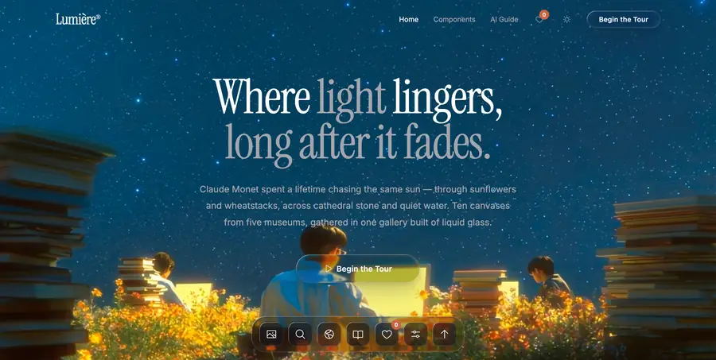
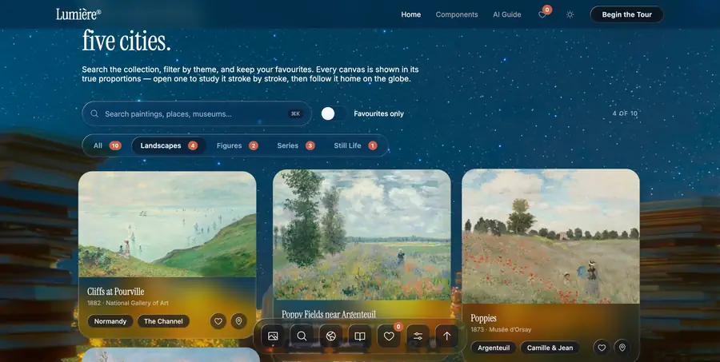
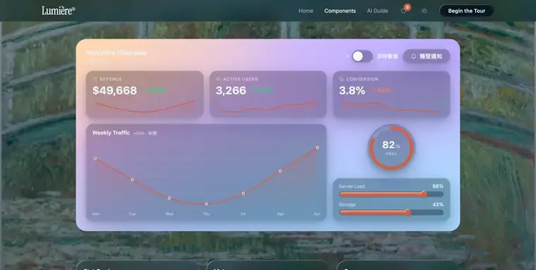
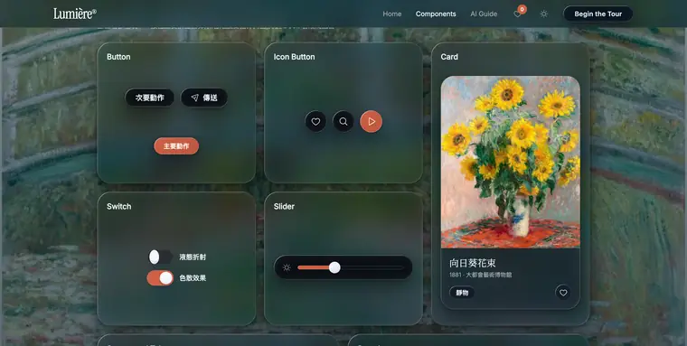
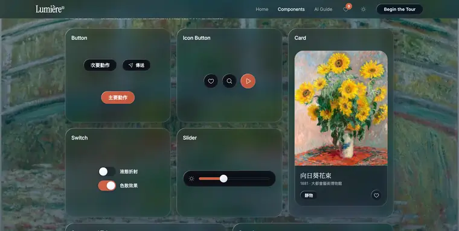
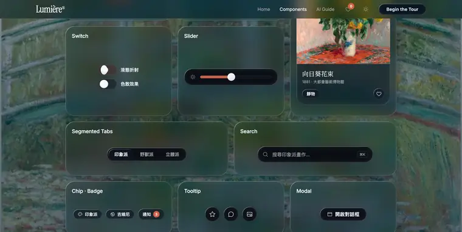
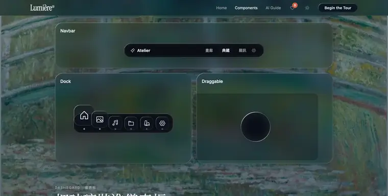
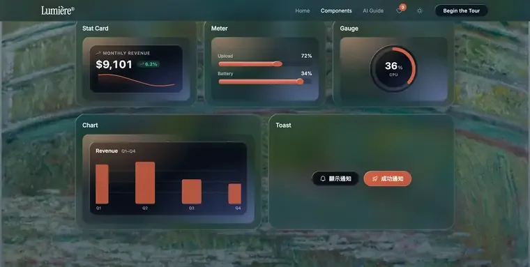

# Liquid Glass Kit

> 零依賴的「液態玻璃」UI 工具包 —— 18 個現成元件、以 Snell 定律即時計算的折射與色散、發光背景、慣性拖曳。複製兩個檔案(`liquid-glass.css` + `liquid-glass.js`)就能用,不需建置工具、不需框架。**而且特別為「直接交給 AI 開發介面」而設計**:一份規格書貼給 Claude / Cursor / Copilot,它就會用這套元件替你拼介面。



> 折射僅 Chromium 引擎(Chrome / Edge / Arc / Electron…)完整支援,其他瀏覽器**自動降級為磨砂玻璃**,版面與互動完全不變。

---

## 用這套能做出什麼

下面全部是 `index.html` 的實際畫面 —— **每一片玻璃、每一個圖表都是工具包的 class 拼出來的,沒有一行自訂玻璃 CSS**。

**內容展廳 / 作品集** — 玻璃導覽列、Dock、搜尋、篩選分頁與卡片漂浮在畫作之上:



**分析儀表板** — 統計卡、折線圖、環形儀表、進度條;改一個 `data-lg-value` 屬性,數字與弧線就以彈簧一起跳動:



**深色主題** — 同一套元件,`<html data-lg-theme="dark">` 一鍵換膚:



---

## 🤖 讓 AI 用這套工具開發

這套工具包**為 AI 協作而生**:元件是固定的 class 與 API、規則濃縮成一份規格書,AI 不必(也不該)自己手刻 `backdrop-filter`,只要照規格用 `.lg` class 即可。給對話式 AI、Claude Code、Cursor、Copilot 都適用。

**三步驟讓 AI 接手:**

1. 把 `liquid-glass.css` 與 `liquid-glass.js` 放進專案。
2. 把下面的「AI 使用規格」存成你的 AI 工具讀得到的設定檔:

   | AI 工具 | 規格書放哪 |
   | --- | --- |
   | **Claude Code** | 專案根目錄 `CLAUDE.md` |
   | **Cursor** | `.cursor/rules/liquid-glass.mdc` |
   | **GitHub Copilot** | `.github/copilot-instructions.md` |
   | **ChatGPT / Claude.ai 等對話式 AI** | 直接貼進對話,後面接上你的任務描述 |

3. 然後就交代任務,例如「**用 Liquid Glass Kit 做一個帶導覽列與三張統計卡的儀表板**」。AI 會用 `.lg` class 與 `LiquidGlass` API 來實作,而不是自己亂寫玻璃樣式。

> `index.html` 的「AI 整合」分頁內也有同一份規格書的一鍵複製按鈕。

<details>
<summary><strong>📋 AI 使用規格(點此展開 / 複製,即是要貼給 AI 的全文)</strong></summary>

```text
# Liquid Glass Kit — AI 使用規格
零依賴液態玻璃 UI 工具包(透明玻璃、即時折射、發光背景、拖曳)。
專案內已有兩個檔案:liquid-glass.css、liquid-glass.js。

## 初始化(每頁一次)
<link rel="stylesheet" href="liquid-glass.css">
<script src="liquid-glass.js"></script>
<script>LiquidGlass.init();</script>

## 鐵則
1. 玻璃只用於浮在內容之上的控制層(導航、卡片、面板、對話框、dock);文章、圖片等內容本身不上玻璃。
2. 折射玻璃 = class="lg" + data-lg;小型或大量重複的元件(列表項、標籤)改用 class="lg lg-static"(磨砂、無折射、便宜)。
3. 頁面必須有圖像或多彩背景,玻璃效果才看得見。
4. 不要手寫 backdrop-filter 或自製玻璃 CSS,一律使用工具包的 class 與 API。
5. 動態插入的節點呼叫 LiquidGlass.attach(el);非 Chromium 瀏覽器會自動降級為磨砂,無需處理。
6. 儀表元件(統計卡/進度條/環形儀表/圖表)= 玻璃容器 + 實心內容層:數字、走勢圖、圖表本身不透明,只有外框是玻璃——內容上玻璃會看不見,這是技術上必要的邊界。

## 元件結構
按鈕:<button class="lg lg-btn" data-lg>文字</button>(修飾:lg-btn--pill / --accent / --icon / --lg / --sm)
卡片:<div class="lg lg-card" data-lg><h4 class="lg-card__title">…</h4><p class="lg-card__meta">…</p></div>
導航:<nav class="lg lg-navbar" data-lg><span class="lg-navbar__brand">…</span><span class="lg-navbar__spacer"></span><button class="lg-navbar__link is-active">…</button></nav>
搜尋:<div class="lg lg-search" data-lg><svg>…</svg><input type="search"><kbd>⌘K</kbd></div>
開關:<label class="lg-switch"><input type="checkbox"><span class="lg-switch__track"><span class="lg-switch__thumb"></span></span>標籤</label>
滑桿:<div class="lg lg-slider" data-lg><input class="lg-slider__input" type="range"></div>
分頁:<div class="lg lg-tabs" data-lg role="tablist"><span class="lg-tabs__pill"></span><button class="lg-tabs__tab is-active" role="tab">…</button>…</div>
對話框:<div class="lg-modal" id="m1"><div class="lg-modal__overlay" data-lg-close></div><div class="lg-modal__panel lg" data-lg role="dialog">…</div></div>;以 <button data-lg-open="#m1"> 開啟、data-lg-close 關閉。
Dock:<div class="lg lg-dock" data-lg><button class="lg-dock__item">icon</button>…</div>(自帶鄰近放大)
標籤:<span class="lg-chip">…</span>;徽章:<span class="lg-badge">3</span>
工具提示:任何元素加 data-lg-tip="文字"
拖曳:元素加 data-lg-drag="viewport|parent"(可選 data-lg-drag-handle=".selector"),或 LiquidGlass.draggable(el, { bounds, inertia })
統計卡:<div class="lg lg-stat" data-lg><span class="lg-stat__label">標籤</span><div class="lg-stat__row"><span class="lg-stat__value" data-lg-value="48250" data-lg-prefix="$"></span><span class="lg-stat__delta"><svg><use href="#ph-trend-up"/></svg>12.4%</span></div><svg class="lg-stat__spark" data-lg-spark="28,31,30,36,40,44"></svg></div>(漲綠跌紅:徽章加 lg-stat__delta--down)
進度條:<div class="lg-meter" data-lg-value="68"></div>(本身非玻璃:凹槽軌道 + 實心液體填充,前緣有彎月鼓頭)
環形儀表:<div class="lg lg-gauge" data-lg data-lg-press data-lg-profile="circle" data-lg-value="74" data-lg-unit="%" data-lg-label="Goal"></div>
圖表:<div class="lg lg-chart" data-lg><div class="lg-chart__head"><h4 class="lg-chart__title">標題</h4></div><svg class="lg-chart__svg" data-lg-chart="line" data-lg-points="1240,1390,1180,1620" data-lg-labels="Mon,Tue,Wed,Thu"></svg></div>(data-lg-chart 可為 line 或 bar;手刻 SVG、零依賴、hover 顯數值)
通知:LiquidGlass.toast({ title, message, icon, duration })(JS 呼叫;右下堆疊、自動消退、最多 4 則)
發光背景:<div class="lg-glow" style="--lg-glow-base:#7d92ad;"><div class="lg-glow__image" style="--lg-bg-image:url(bg.jpg);"></div></div>

## 屬性(單一元素覆寫)
data-lg-refraction(折射倍率,預設 1.25)、data-lg-chromatic(色散 0–1)、data-lg-blur、data-lg-saturate、data-lg-bezel(斜面 px)、data-lg-thickness(厚度 px)、data-lg-profile(squircle|circle|lip)
儀表資料(屬性驅動):data-lg-value(統計卡/進度條/環形儀表的目標值)、data-lg-spark(統計卡走勢逗號數列)、data-lg-points + data-lg-labels(圖表資料)、data-lg-prefix / -suffix / -decimals(數字格式)。改變 data-lg-value / -spark / -points 即觸發彈簧動畫(單一 MutationObserver 自動接手,無需手動呼叫)。

## JS API
LiquidGlass.init(config?) / attach(el, opts?) / draggable(el, opts?) / refresh() / toast({ title, message, icon, duration }) / config / supported / reducedMotion

## Tokens(:root 覆寫)
--lg-accent(品牌色,預設 #cf6045)、--lg-tint、--lg-text、--lg-radius-s/m/l/pill、--lg-blur-fallback、--lg-font
主題:<html data-lg-theme="dark">,不設則跟隨系統。
```

</details>

---

## 元件一覽

18 件元件,分四組。完整 HTML 都在上面的規格書,也能在 `index.html` 的「元件與指引」分頁即時調參、一鍵複製。

**基礎** — 按鈕 `.lg-btn`(修飾 `--pill` `--accent` `--icon` `--lg` `--sm`)、圖示按鈕 `.lg-btn--icon`、卡片 `.lg-card`。按下有彈簧擠壓回彈。



**控制** — 開關 `.lg-switch`(純 CSS)、滑桿 `.lg-slider`、分頁 `.lg-tabs`(膠囊液態遷移)、搜尋框 `.lg-search`。



**導覽與互動** — 導覽列 `.lg-navbar`、Dock `.lg-dock`(游標鄰近放大)、拖曳 `data-lg-drag`(慣性 + 拉伸)、工具提示 `data-lg-tip`、對話框 `.lg-modal`、標籤 `.lg-chip` · 徽章 `.lg-badge`。



**資料視覺化** — 統計卡 `.lg-stat`、進度條 `.lg-meter`、環形儀表 `.lg-gauge`、圖表 `.lg-chart`、通知 `LiquidGlass.toast()`。全部「屬性驅動」:改 `data-lg-value` / `-spark` / `-points` 即觸發彈簧動畫。



> 這幾件是「玻璃容器 + 實心內容層」:外框是玻璃,但數字、走勢圖、圖表本身不透明——內容上玻璃會看不見,這是技術上必要的邊界。

---

## 快速開始

```html
<link rel="stylesheet" href="liquid-glass.css">
<script src="liquid-glass.js"></script>
<script>LiquidGlass.init();</script>

<!-- 玻璃材質 + 即時折射 -->
<div class="lg lg-card" data-lg>內容</div>

<!-- 輕量磨砂(不折射,適合小或大量重複的元件) -->
<span class="lg lg-static">內容</span>
```

`class="lg"` 提供材質,`data-lg` 啟用折射,通常一起用;動態插入的節點呼叫 `LiquidGlass.attach(el)`。頁面要有圖像或多彩背景,玻璃才看得見(可用 `.lg-glow` 容器)。其餘元件結構、屬性與 API 全在上面的規格書。

## 瀏覽器支援

| 環境 | 行為 |
| --- | --- |
| Chrome / Edge / Arc / Opera / Electron 等 Chromium | 完整液態折射與色散 |
| Safari / Firefox / iOS 全部瀏覽器 | 自動降級為磨砂玻璃,版面與互動完全相同 |
| 系統「降低透明度 / 減少動態」 | 自動停用折射 / 動畫 |

偵測是自動的,不需手動處理。

## 授權與素材

程式碼可自由用於個人與商業專案。圖示來自 Phosphor Icons(MIT License);畫作為 Claude Monet《向日葵花束》(1881)、《睡蓮池上的橋》(1899)與《撐陽傘的女人(面向左)》(1886),均為公有領域。
