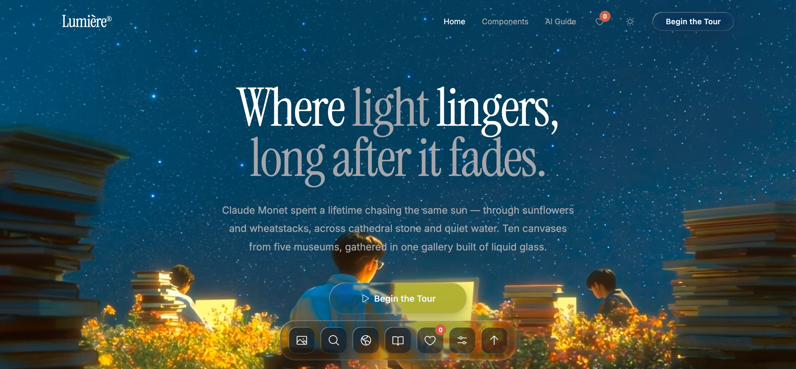
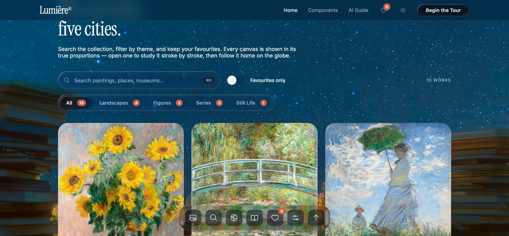
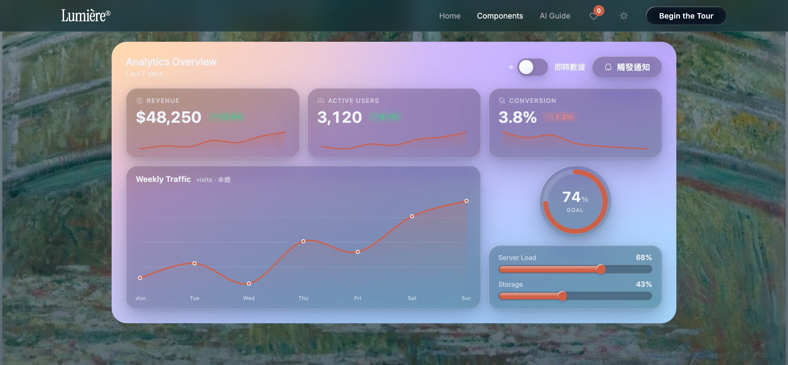
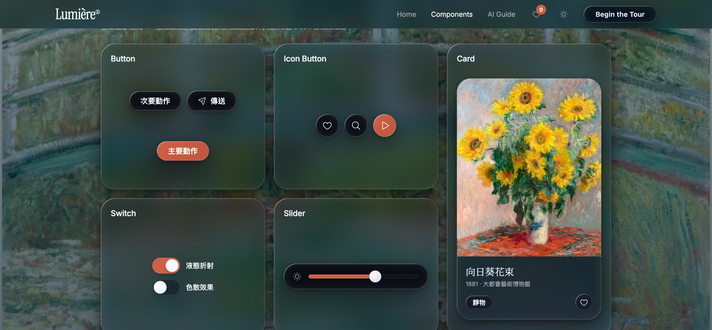
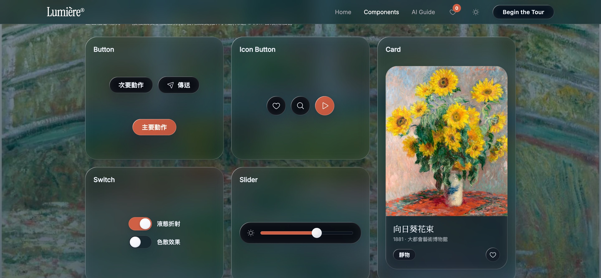
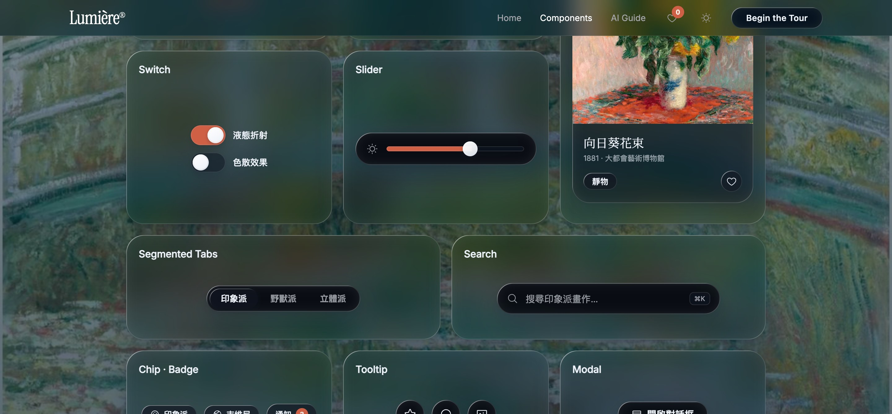
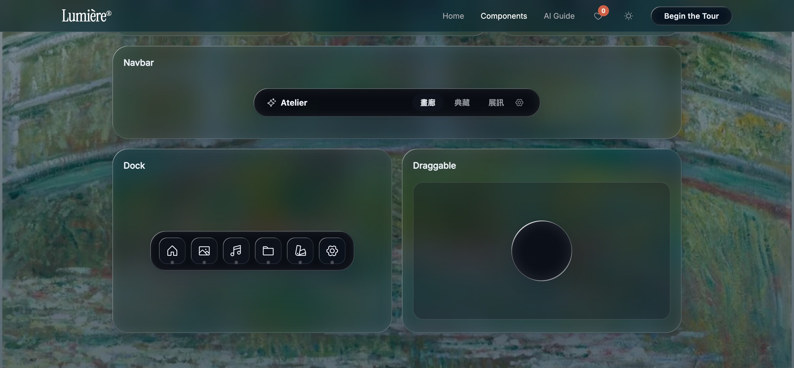
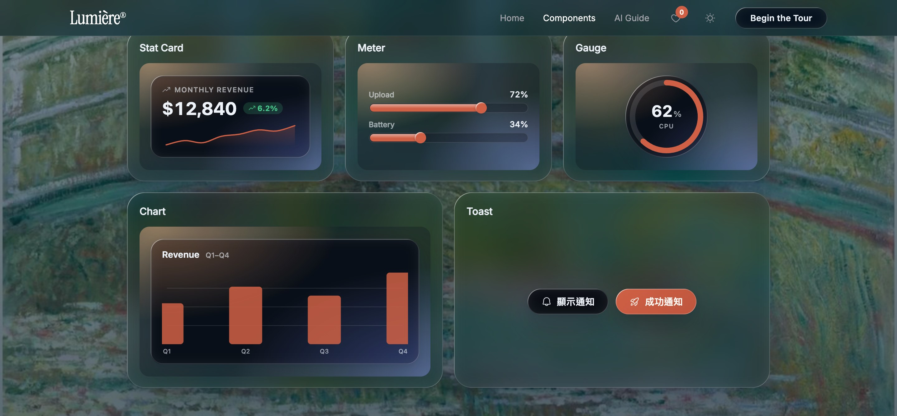

# Liquid Glass Kit

> 零依賴的「液態玻璃」UI 工具包。透明玻璃材質、以 Snell 定律即時計算的液態折射與色散、發光背景、慣性拖曳,加上 **18 個現成元件**。複製兩個檔案(`liquid-glass.css` + `liquid-glass.js`)就能用在任何 Web / WebView / Electron 介面,**不需要建置工具、不需要框架**。



折射只用一句 `backdrop-filter` 即時彎曲元件背後的真實內容,因此**畫面有圖片或多彩背景時最好看**。此效果僅 Chromium 引擎(Chrome / Edge / Arc / Electron…)完整支援,其他瀏覽器**自動降級為磨砂玻璃**,版面與互動完全不變。

---

## 用這套工具包能做出什麼

下面三張全部是 `index.html` 的實際畫面 —— **每一片玻璃、每一個圖表都是工具包的 class 拼出來的,沒有一行自訂玻璃 CSS**。打開 `index.html` 就能看到、調參、複製。

### 🖼 內容展廳 / 作品集網站

玻璃導覽列、底部 Dock、搜尋框、篩選分頁與卡片**漂浮在畫作之上**,內容是主角、玻璃只做控制層。



### 📊 分析儀表板

統計卡、折線圖、環形儀表、進度條組成的儀表板浮在彩色漸層上。打開「即時數據」開關,所有數字、走勢圖、弧線會以彈簧一起跳動 —— 全靠改一個 `data-lg-value` 屬性驅動。



### 🌙 深色主題,一鍵切換

同一套元件,在 `<html>` 加上 `data-lg-theme="dark"` 即整體換膚(不設則跟隨系統)。



---

## 元件總覽

18 件元件,分四組。每件的完整 HTML 都能在 `index.html` 的「元件與指引」分頁即時調參並一鍵複製。

### 基礎:按鈕 · 圖示按鈕 · 卡片



| 元件 | Class | 說明 |
| --- | --- | --- |
| 按鈕 | `.lg-btn` | 修飾子 `--pill` `--accent` `--icon` `--lg` `--sm`;按下有彈簧擠壓、放開欠阻尼回彈,折射玻璃同步鼓起 |
| 圖示按鈕 | `.lg-btn--icon` | 圓形,適合工具列與浮動操作 |
| 卡片 | `.lg-card` | 標題 `.lg-card__title`、說明 `.lg-card__meta`,可內嵌圖片、chip 與操作 |

### 控制:開關 · 滑桿 · 分頁 · 搜尋



| 元件 | Class | 說明 |
| --- | --- | --- |
| 開關 | `.lg-switch` | 純 CSS、原生 checkbox;切換時錨點液滴被拉斷並在另一端重聚 |
| 滑桿 | `.lg-slider` | 包住原生 `range`,玻璃軌道 + 珊瑚紅填充 |
| 分頁 | `.lg-tabs` | 膠囊指示器在切換時「液滴遷移」:途中拉長、抵達擠壓 |
| 搜尋框 | `.lg-search` | 內建圖示與 `⌘K` 快捷鍵標示 |

### 導覽與互動:導覽列 · Dock · 拖曳



| 元件 | Class / 屬性 | 說明 |
| --- | --- | --- |
| 導覽列 | `.lg-navbar` | brand + 連結 + `__spacer` 撐開的彈性排版 |
| Dock | `.lg-dock` | 自帶游標鄰近放大與底部液滴黏滯融合 |
| 拖曳 | `data-lg-drag="viewport \| parent"` | 拖動時沿速度方向拉伸、釋放後慣性滑行並以果凍抖動收斂 |
| 工具提示 | `data-lg-tip="文字"` | 任何元素加屬性即可 |
| 對話框 | `.lg-modal` | `data-lg-open="#id"` 開啟、`data-lg-close` 關閉;出場為液滴落地回彈,支援 Esc |
| 標籤 / 徽章 | `.lg-chip` / `.lg-badge` | 輕量,建議用 `.lg-static` 磨砂版 |

### 資料視覺化:統計卡 · 進度條 · 環形儀表 · 圖表 · 通知



| 元件 | Class / API | 說明 |
| --- | --- | --- |
| 統計卡 | `.lg-stat` | 數值 + 漲跌徽章(漲綠跌紅)+ sparkline 走勢 |
| 進度條 | `.lg-meter` | 凹槽軌道 + 實心液體填充,前緣有彎月鼓頭 |
| 環形儀表 | `.lg-gauge` | 玻璃圓 + SVG 弧,結構由 JS 注入 |
| 圖表 | `.lg-chart` | `line` 或 `bar`,手刻 SVG、零依賴、hover 顯數值 |
| 通知 | `LiquidGlass.toast({ title, message, icon, duration })` | 右下堆疊、自動消退、最多 4 則 |

> **重點:這幾件是「玻璃容器 + 實心內容層」。** 外框是玻璃,但數字、sparkline、圖表本身**不透明**——內容上玻璃會看不見,這是技術上必要的邊界。資料全部「屬性驅動」:改 `data-lg-value` / `-spark` / `-points` 就會觸發彈簧動畫(展示站的「即時數據」開關正是如此每 2 秒跳動)。

---

## 快速開始

1. 複製 `liquid-glass.css` 與 `liquid-glass.js` 到專案。
2. 引入並初始化(每頁一次):

```html
<link rel="stylesheet" href="liquid-glass.css">
<script src="liquid-glass.js"></script>
<script>
  LiquidGlass.init({ refraction: 1.25, chromatic: 0.55 });
</script>
```

3. 替元素加上玻璃:

```html
<!-- 玻璃材質 + 液態折射 -->
<div class="lg lg-card" data-lg>內容</div>

<!-- 單一元素微調 -->
<div class="lg lg-card" data-lg data-lg-refraction="1.6" data-lg-chromatic="0.8">內容</div>

<!-- 輕量磨砂(不折射,適合小或大量重複的元件) -->
<span class="lg lg-static">內容</span>
```

`class="lg"` 提供材質(底色、鏡面 rim light、動態光澤、陰影);`data-lg` 啟用折射引擎,兩者通常一起用。動態插入的節點呼叫 `LiquidGlass.attach(el)`。

頁面需要一個有圖像或多彩的背景,玻璃才看得見:

```html
<div class="lg-glow" style="--lg-glow-base:#7d92ad;">
  <div class="lg-glow__image" style="--lg-bg-image:url('bg.jpg');"></div>
  <!-- 其上的內容 -->
</div>
```

---

## 運作原理

工具包對每個玻璃元素生成一張位移貼圖:沿圓角矩形邊緣取「凸超橢圓(convex squircle)」斷面,以 Snell 定律(折射率 1.5)做光線追蹤,算出光線穿過玻璃後的橫向偏移,寫入貼圖的 R(X 位移)與 G(Y 位移)通道,再透過 SVG `feDisplacementMap` 搭配 `backdrop-filter` 即時折射元素背後的真實內容。色散由 RGB 三通道以略微不同的位移倍率合成。凸面斷面讓位移永遠指向元件內部,邊緣取樣不會越界。

## 瀏覽器支援

| 環境 | 行為 |
| --- | --- |
| Chrome、Edge、Arc、Opera、Electron 等 Chromium | 完整液態折射與色散 |
| Safari、Firefox、iOS 全部瀏覽器 | 自動降級為磨砂玻璃(blur + saturate),版面與互動完全相同 |
| 系統開啟「降低透明度」 | 改用近不透明面板,停用折射與模糊 |
| 系統開啟「減少動態效果」 | 停用發光漂移、慣性與彈性動畫 |

偵測是自動的:`liquid-glass.js` 會在 `<html>` 標上 `lg-full` 或 `lg-fallback`,不需手動處理。

## JavaScript API

| 方法 / 屬性 | 說明 |
| --- | --- |
| `LiquidGlass.init(config?)` | 偵測能力、套用全域設定、掃描 `data-lg` 並啟動所有元件。整頁呼叫一次。 |
| `LiquidGlass.attach(el, opts?)` | 手動替元素掛折射(動態節點)。回傳實例,含 `update()` `setOptions()` `destroy()` `setBulge(k)`。 |
| `LiquidGlass.draggable(el, opts?)` | 啟用拖曳。`opts = { handle, bounds: 'viewport'\|'parent', inertia }`。回傳 `{ destroy() }`。 |
| `LiquidGlass.toast({ title, message, icon, duration })` | 顯示右下角通知。 |
| `LiquidGlass.refresh()` | 全域設定改變後同步所有實例(只改濾鏡倍率,不重算貼圖,代價極低)。 |
| `LiquidGlass.Spring(value, opts)` | 自訂彈簧動畫:`{ stiffness, damping, onUpdate, onRest }`。 |
| `LiquidGlass.config` / `.supported` / `.reducedMotion` | 全域設定物件 / 是否完整折射 / 是否減少動態。 |

### 全域設定(`init()` 參數 / `LiquidGlass.config`)

| 鍵 | 預設 | 說明 |
| --- | --- | --- |
| `refraction` | `1.25` | 折射強度倍率,1 為物理值 |
| `chromatic` | `0.55` | 色散強度 0–1 |
| `blur` | `1.6` | 玻璃內霧化 px |
| `saturate` | `1.55` | 透過玻璃的飽和度 |
| `bezel` | `0.16` | 邊緣斜面寬,佔短邊比例 |
| `thickness` | `28` | 玻璃厚度 px |
| `profile` | `'squircle'` | 斷面:`squircle` `circle` `lip` |
| `ior` | `1.5` | 折射率 |
| `maxWidth` | `900` | 超過此寬度自動減弱折射,保護 GPU |

### HTML 屬性

| 屬性 | 說明 |
| --- | --- |
| `data-lg` | 啟用折射 |
| `data-lg-refraction` `-chromatic` `-blur` `-saturate` `-bezel` `-thickness` `-profile` | 覆寫單一元素的對應設定 |
| `data-lg-value` `-spark` `-points` `-labels` `-prefix` `-suffix` `-decimals` | 儀表元件的資料來源(改值即觸發彈簧動畫) |
| `data-lg-drag="viewport \| parent"` · `data-lg-drag-handle=".sel"` | 拖曳與把手 |
| `data-lg-tip="文字"` | 工具提示 |
| `data-lg-open="#id"` / `data-lg-close` | 開關對話框 |
| `data-lg-theme="dark"`(加在 `<html>`) | 手動切換暗色;不加則跟隨系統 |

## CSS Tokens

所有顏色與節奏都可在 `:root` 覆寫。常用:`--lg-tint`(玻璃底色)、`--lg-accent`(品牌色,預設為莫內畫中胸花的珊瑚紅 `#cf6045`,換成品牌色即整體換膚)、`--lg-text` / `--lg-text-dim`、`--lg-radius-s/m/l/pill`、`--lg-shadow`、`--lg-ease`(液態回彈曲線)、`--lg-blur-fallback`、`--lg-font`。完整清單見 `liquid-glass.css` 第一節。

## 效能準則

折射成本與面積成正比。大面板留給真正重要的層;小而大量重複的元件(列表項、標籤)用 `.lg-static` 磨砂即可。寬度超過 `maxWidth`(預設 900px)會自動減弱折射。位移貼圖以尺寸為鍵快取,同尺寸元件共用同一張;調整 `refraction` / `chromatic` / `blur` / `saturate` 不會觸發重算。

## 無障礙

互動元件具備鍵盤焦點樣式(`:focus-visible`)、分頁支援方向鍵、對話框支援 Esc 關閉並歸還焦點、開關以原生 checkbox 實作。`prefers-reduced-transparency` 與 `prefers-reduced-motion` 皆有對應降級。玻璃上的文字請維持足夠對比,必要時提高該元素的 `--lg-tint` 不透明度。

## 設計準則

玻璃是控制層,內容才是主角。只把玻璃用在漂浮於內容之上的導航、工具列、面板與對話框;內容本身(文章、圖片、表格)不上玻璃。層級靠深度與折射傳達——愈靠近使用者的層,玻璃感愈明確。克制使用:整個畫面只有少數幾片玻璃時,材質才珍貴。

## AI 開發工具整合

`index.html` 的「AI 整合」分頁內含一份可一鍵複製的 AI 規格書(濃縮全部元件結構、屬性與鐵則)。把它存成專案根目錄的 `CLAUDE.md`(Claude Code)、`.cursor/rules/liquid-glass.mdc`(Cursor)或 `.github/copilot-instructions.md`(GitHub Copilot),AI 之後就會以工具包的 class 與 API 實作介面,而不是自己手寫 backdrop-filter;對話式 AI 直接貼上規格書加任務描述即可。

## 授權與素材

程式碼可自由用於個人與商業專案。圖示來自 Phosphor Icons(MIT License);畫作為 Claude Monet《向日葵花束》(1881)、《睡蓮池上的橋》(1899)與《撐陽傘的女人(面向左)》(1886),均為公有領域。
