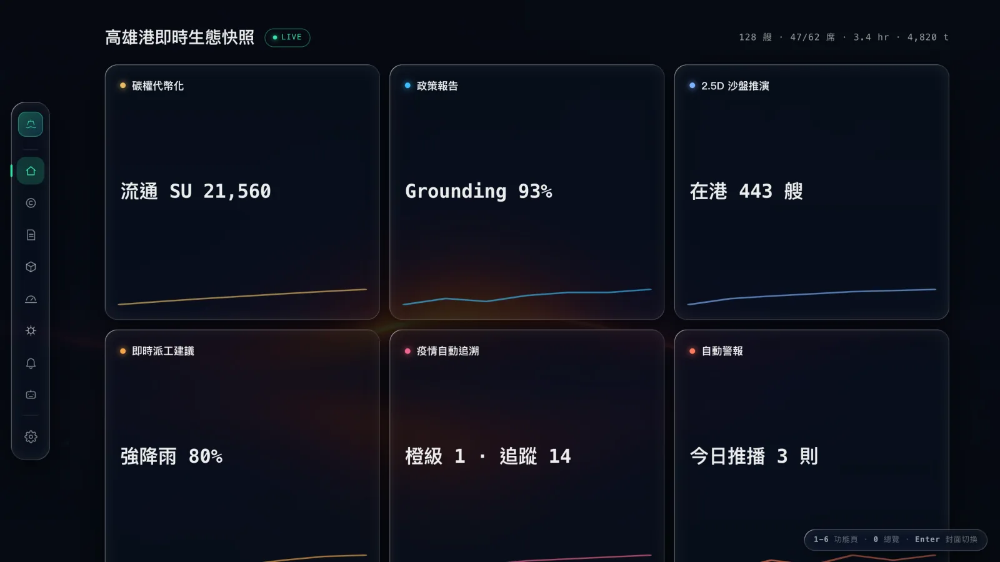
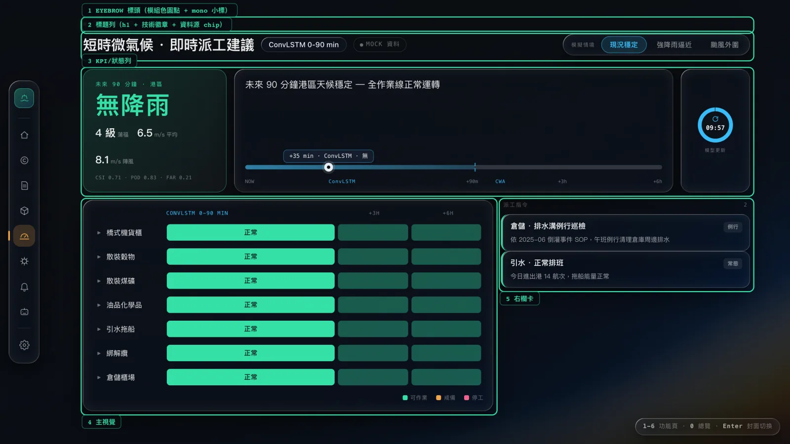
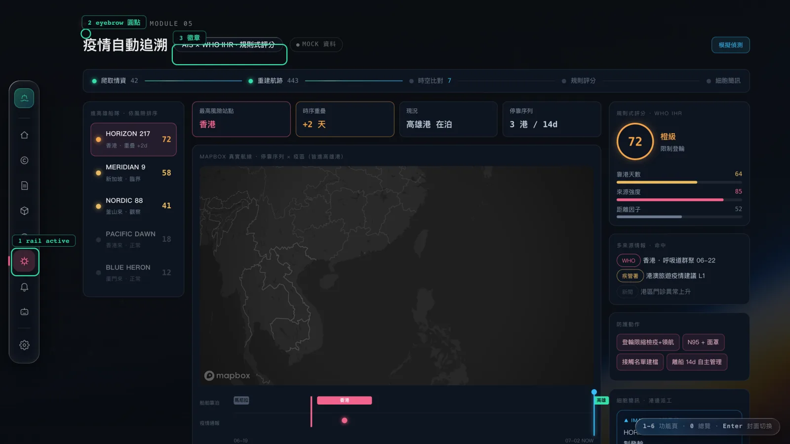
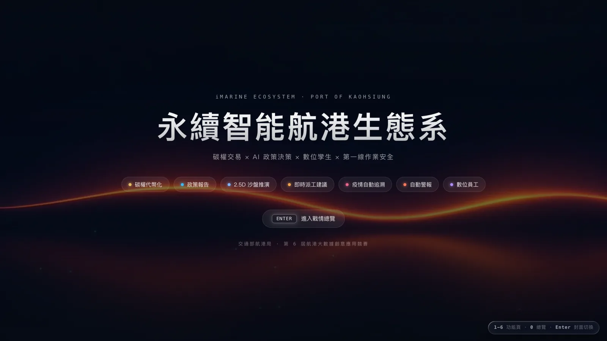
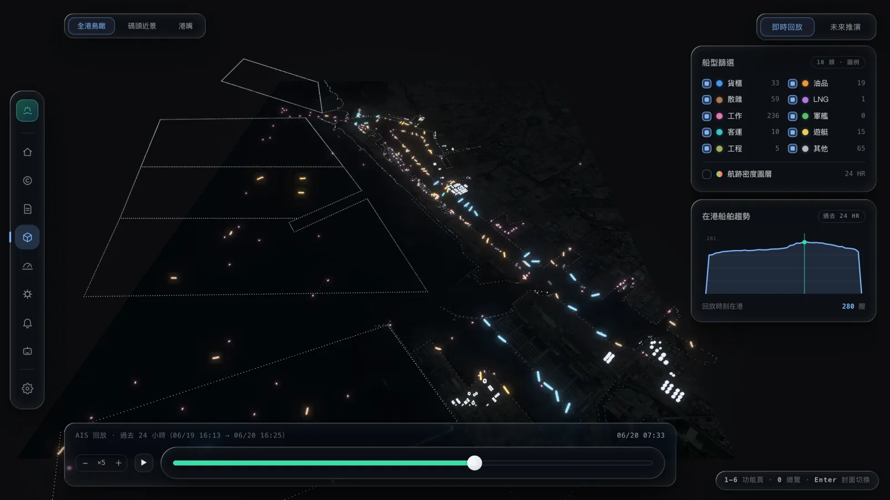
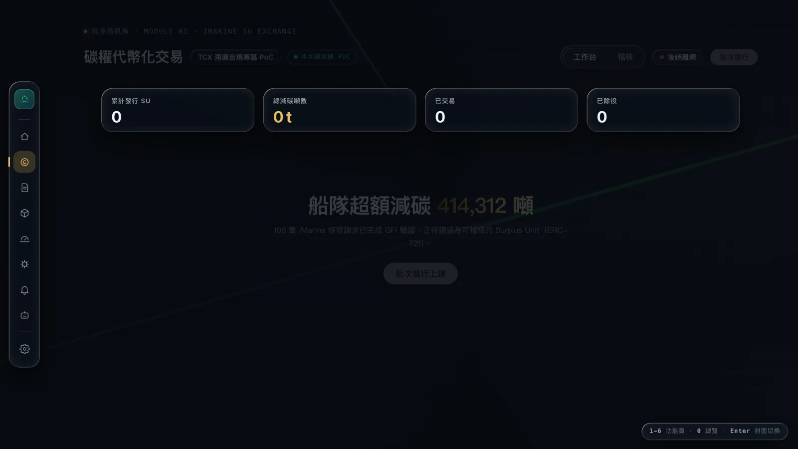

# iMarine 案例：深色 Liquid Glass 儀表板

iMarine 是「2026 航港大數據創意應用競賽」的前端整合層：9 個 screens、深色 Liquid Glass 語言、Vite + vanilla TS 的 shell 應用，全部畫面用本 Kit（Liquid Glass Kit）既有的 class 拼起來，**零自訂玻璃 CSS**。它是目前用這套 Kit 蓋出來最完整的實戰產品，這篇案例文件把它拆解成四個可複製 pattern，給之後用這個 Kit 的人（或 AI）一份「怎麼組」的參照。

四個 pattern 借用 Material Design 的三層語彙定位：

- §1 深色主題 tokens 系統、§3 模組輔助色相系統、§4 背景層與 scrim 兩態——都是 **foundations** 層的實戰值。
- §2 儀表板頁面節奏——是一個 **canonical layout**（Material 的 supporting pane 變體：主視覺 ~62% + 右欄卡）。

文末 §5 有一份濃縮版、可以直接貼給 AI 的補充規格。



---

## §1　深色主題 tokens 系統（foundations）

**Why**：Kit 展示站預設語境偏亮色，深色場景下要用的文字梯度、髮絲線、動畫緩動需要一套已經驗證過、彼此搭配的值，不是憑感覺挑灰階。

**When to use**：暗場景儀表板、監控台、簡報 demo。
**When NOT**：內容閱讀型長文頁（大段文字長時間停留在整頁沉浸式深色底上容易疲勞，這類頁面應偏向 §4 的 doc 態壓暗，而不是追求空間感）。

規則（Do / Don't）：

- Do 文字梯度只用 ink 四階（`.92` / `.62` / `.5` / `.4`）；Don't 用任意灰值另挑對比。
- Do 分隔線／邊框一律 `--hair`；Don't 用實色灰線。
- Do 動畫緩動一律 `--ease`；Don't 一頁裡混用多條 easing 曲線。
- Do 數據、代碼、eyebrow 小標用 `--mono`；Don't 整頁套 monospace。

可複製代碼（逐字抄自 iMarine `src/ui/tokens.css`，比對基準 commit `89b8d4a`）：

```css
:root{
  --lg-accent:#35E0A6;
  --bg:#070b11;
  --gold:#E9BC63; --cyan:#38BDF8; --amber:#F5A54A; --rose:#F0648C; --flame:#FF7A59;
  --ink-90:rgba(255,255,255,.92); --ink-60:rgba(255,255,255,.62);
  --ink-50:rgba(255,255,255,.5); --ink-40:rgba(255,255,255,.4);
  --hair:rgba(255,255,255,.1);
  --ease:cubic-bezier(.22,1,.36,1);
  --mono:"Geist Mono",ui-monospace,SFMono-Regular,Menlo,monospace;
}
body{
  background:var(--bg);color:var(--ink-90);
  font-family:"Inter","Noto Sans TC","PingFang TC","Microsoft JhengHei",system-ui,sans-serif;
}
```

Kit 銜接：在根元素設 `document.documentElement.setAttribute('data-lg-theme', 'dark')`（或直接寫死 `<html data-lg-theme="dark">`），Kit 元件即整套切換到深色皮層，不需要另外覆寫元件內部樣式。

---

## §2　儀表板頁面節奏（canonical layout：supporting pane 變體）

**Why**：多頁產品如果每頁節奏不一樣，使用者換頁就得重新學版面；固定一套縱向節奏，內容再怎麼變，操作直覺可以延續。

**When to use**：需要多個功能頁共存、彼此要有一致操作直覺的儀表板類產品。
**When NOT**：單頁 marketing / 著陸頁，或內容本身不適合「主視覺 + 右欄卡」二欄配置的場合（例如純表單流程）。

公式五步：eyebrow 標頭 → 標題列（h1 + 技術徽章 + 資料源 chip）→ KPI／狀態列（頁面特化）→ 主視覺（~62%）＋ 右欄卡 → stagger 進場。其中 eyebrow + 標題列（`screenHeader()`）與 `.anim` stagger 是 iMarine 七個功能頁**真．共用**的部分；KPI／狀態列與 body 二欄則由各頁依內容特化（見下方誠實註記）。

規則（Do / Don't）：

- Do 進場 stagger 用 `.anim` + `style="--d:.08s"` 遞增（頁首固定 `--d:0s` 最先進場）；Don't 整頁同時進場。
- Do KPI 卡守「玻璃容器 + 實心內容」鐵則（數字、sparkline 不透明）；Don't 在內容上再蓋一層玻璃。
- Do 小型／大量重複元件用 `lg-static`；Don't 每一列都掛即時折射運算。
- Do 資料源如實顯示（live 用綠 chip、mock 用灰 chip）；Don't 假裝 live。

可複製代碼（頁面 HTML 骨架）——`<header>` 區塊是 iMarine `screenHeader()` 的**實際輸出**（七頁共用，逐字忠實照抄）；`.stats4` / `.cols` / `.stack` 是 tokens.css 提供的**版面基元**（值真實、可直接套用）：

```html
<header class="anim" style="--d:0s">
  <div class="eyebrow"><span class="dot" style="--mc:#F5A54A"></span><span class="lbl">航港局視角 · MODULE 04</span></div>
  <div class="trow">
    <h1>短時微氣候 · 即時派工建議</h1>
    <span class="lg-chip">ConvLSTM</span><span class="lg-chip">CWA 開放資料</span>
    <span class="src"><i></i>MOCK 資料</span>
    <span class="spacer"></span>
  </div>
</header>

<div class="stats4 anim" style="--d:.08s">
  <div class="lg lg-stat" data-lg>
    <span class="lg-stat__label">平均風速</span>
    <span class="lg-stat__value" data-lg-value="7.2" data-lg-decimals="1" data-lg-suffix=" m/s">0</span>
    <span class="lg-stat__delta">+0.8 vs 前 1h</span>
    <svg class="lg-stat__spark" data-lg-spark="5,6,6.5,7,7.2"></svg>
  </div>
  <!-- 同構 lg-stat 共 4 張 -->
</div>

<div class="cols">
  <div class="lg lg-card anim" data-lg style="--d:.14s">
    <!-- 主視覺：圖表 / 地圖 / 時間軸（實心內容層） -->
  </div>
  <div class="stack">
    <div class="lg lg-card anim" data-lg style="--d:.20s"><!-- 右欄卡 1 --></div>
    <div class="lg lg-card anim" data-lg style="--d:.26s"><!-- 右欄卡 2 --></div>
  </div>
</div>
```

配套格線 CSS（逐字抄自 tokens.css）：

```css
.stats4{display:grid;grid-template-columns:repeat(4,1fr);gap:14px;margin-bottom:18px;}
.cols{display:grid;grid-template-columns:1.55fr 1fr;gap:16px;align-items:start;}
.stack{display:flex;flex-direction:column;gap:14px;}
```

（`1.55fr 1fr` 即主視覺 ~62%——supporting pane 的比例。）

**誠實註記**：`.stats4` / `.cols` 是 tokens.css 提供的版面基元、值真實可直接套用，但目前 iMarine 各功能頁多半**特化自己的 body 版面**，不是逐字同名套用同一組 class：carbon 用 4-up 的 `.stats` KPI grid、dispatch 用 62:38 的 `.dcols` supporting pane、policy 用 `.pcols`。七頁真正共用的是「頁首 `screenHeader()` ＋ `.anim` stagger ＋ supporting pane 的**概念**」，不是逐字同名的 body class。把 `.stats4` / `.cols` 當成設計層提供、頁面可以直接套用、也可以照自己內容特化的基元來用；不要宣稱每一頁都逐字用了 `.stats4` / `.cols`。

Anatomy 標註圖（實拍頁 = **dispatch**）：



此頁第 3 區塊（`.hero`）是「狀態彙總列」（天候 / 結論時間軸 / 模型倒數環），不是四張同構 KPI 卡——4-up KPI 的實例在 carbon 頁的 `.stats`；第 4/5 區塊才是 `.dcols` 的 62:38 二欄（主視覺 + 右欄卡）。

---

## §3　模組輔助色相系統（foundations：多模組識別色紀律）

**Why**：多模組產品需要各模組可辨識的識別色，但玻璃介面一旦大面積上彩色，材質感就毀了。

**When to use**：多模組／多租戶產品，需要在導覽或標頭讓使用者一眼認出「現在在哪個模組」。
**When NOT**：單模組產品，或色彩本身已承載其他語意（例如成功／失敗、live／mock 的狀態色）——這類場合不要再借用 `--mc` 混淆語意。

核心機制：色相只經 CSS 變數 `--mc` 注入，元件樣式只寫一次、換模組只換一個變數，零樣式分支（逐字抄自實碼）：

```css
.eyebrow .dot{background:var(--mc,#35E0A6);box-shadow:0 0 10px var(--mc,#35E0A6);}
.rbtn.on{background:color-mix(in srgb,var(--mc,#35E0A6) 20%,transparent);}
```

用法：`<span class="dot" style="--mc:#F5A54A"></span>`。

規則（Do / Don't）：

- Do 色相只出現在三個位置：導覽 rail active、eyebrow 圓點、徽章；Don't 拿色相當卡片底色或大面積填色。
- Do 主行動色（按鈕、live chip、正向數據）永遠用 `--lg-accent`；Don't 讓模組色搶走行動色的語意。

七色相表：

| 模組 | 色相 |
| --- | --- |
| carbon 金 | `#E9BC63` |
| policy 青 | `#38BDF8` |
| twin 藍 | `#7FB4FF` |
| dispatch 琥珀 | `#F5A54A` |
| epidemic 玫紅 | `#F0648C` |
| alert 橘紅 | `#FF7A59` |
| agent 紫 | `#B48CFF` |

Anatomy 標註圖：



---

## §4　背景層與 scrim 兩態（foundations：玻璃的舞台）

**Why**：Kit 的鐵則之一是「頁面必須有多彩背景」，這裡是它在真實產品裡的放大版——背景要怎麼給、又要壓多暗才不會搶走內容的注意力。

**When to use**：需要沉浸式、有空間氛圍的頁面（hero、地圖、監控畫面）。
**When NOT**：需要長時間閱讀文字的頁面——背景動態會分散注意力，這類頁面應該把 scrim 壓到最重的 doc 態，而不是追求空間感。

分層結構（z-index 由下而上）：`#harbor` 點雲 canvas → `.glowfx` 光暈 → `#veil` 暗罩 → `#backdrop` 影片 → `#backdrop-scrim` → 內容層。全站共用單一 `<video>`，換頁只換 `src`，不重新掛載元素。

兩態：空間型頁（hero / twin）背景亮、文件型頁（表格 / 長文）scrim 壓暗，由 `body[data-mode]` 驅動、純 CSS 切態，不用 JS 算透明度。

規則（Do / Don't）：

- Do 影片退為氛圍：`opacity:.8` + `filter:brightness(.75)`；Don't 讓背景與內容搶對比。
- Do scrim 用同色系（`rgba(7,11,17,x)`）漸層；Don't 用黑色純色蓋。
- Do reduced-motion 時換成 poster 靜態幀；Don't 強行播放影片。

可複製代碼（逐字抄自 tokens.css）：

```css
#backdrop{position:fixed;inset:0;width:100%;height:100%;object-fit:cover;object-position:center;z-index:3;pointer-events:none;display:none;opacity:.8;filter:brightness(.75);}
body[data-bg="on"] #backdrop{display:block;}
#backdrop-scrim{position:fixed;inset:0;z-index:4;pointer-events:none;opacity:0;transition:opacity .3s var(--ease);
  background:linear-gradient(180deg,rgba(7,11,17,.5),rgba(7,11,17,.15) 45%,rgba(7,11,17,.62));}
body[data-bg="on"] #backdrop-scrim{opacity:1;}
body[data-bg="on"][data-mode="cover"] #backdrop-scrim{background:linear-gradient(180deg,rgba(7,11,17,.5),rgba(7,11,17,.15) 45%,rgba(7,11,17,.62));}
body[data-bg="on"][data-mode="ov"] #backdrop-scrim{background:linear-gradient(180deg,rgba(7,11,17,.72),rgba(7,11,17,.6) 45%,rgba(7,11,17,.8));}
body[data-bg="on"][data-mode="doc"] #backdrop-scrim{background:linear-gradient(180deg,rgba(7,11,17,.86),rgba(7,11,17,.8) 50%,rgba(7,11,17,.9));}
```

三態對照（`cover` 最輕、`ov` 略暗給空間頁、`doc` 最重保住文字可讀性）：





---

## §5 貼給 AI 的補充規格

以下純文字接在 README「AI 使用規格」主規格之後貼給 AI 使用；與主規格衝突時以主規格為準。

```text
# Liquid Glass Kit — 深色儀表板補充規格（接在主規格之後）
來源：iMarine 實戰案例（docs/case-imarine.md）。

## 深色 tokens（:root 覆寫 + <html data-lg-theme="dark">）
:root{ --lg-accent:#35E0A6; --bg:#070b11;
  --gold:#E9BC63; --cyan:#38BDF8; --amber:#F5A54A; --rose:#F0648C; --flame:#FF7A59;
  --ink-90:rgba(255,255,255,.92); --ink-60:rgba(255,255,255,.62);
  --ink-50:rgba(255,255,255,.5); --ink-40:rgba(255,255,255,.4);
  --hair:rgba(255,255,255,.1); --ease:cubic-bezier(.22,1,.36,1); }
body{background:var(--bg);color:var(--ink-90);
  font-family:"Inter","Noto Sans TC",system-ui,sans-serif;}
規則：文字只用 ink 四階；分隔線只用 --hair；緩動只用 --ease；數據與小標用 monospace。

## 頁面節奏（由上而下，每頁一致）
1 eyebrow（模組色圓點 + mono 小標）→ 2 標題列（h1 + lg-chip 技術徽章 + 資料源 chip）
→ 3 KPI 統計列（lg-stat ×4）→ 4 主視覺(~62%) + 右欄卡（grid 1.55fr/1fr）
→ 5 stagger 進場（.anim + style="--d:.08s" 遞增，頁首 --d:0s）。
儀表鐵則：玻璃只做容器，數字/圖表/sparkline 為實心內容層。
資料源 chip 如實顯示：live 綠 / mock 灰。

## 模組識別色（多模組產品）
每模組一色相，只准出現在三個位置：導覽 active 態、eyebrow 圓點、徽章。
Don't：拿色相當卡片底色或大面積填色。主行動色永遠 --lg-accent。
機制：元件樣式吃 var(--mc)，換模組只換 style="--mc:#..."，零樣式分支。
範例盤：金 #E9BC63 青 #38BDF8 藍 #7FB4FF 琥珀 #F5A54A 玫紅 #F0648C 橘紅 #FF7A59 紫 #B48CFF

## 背景與 scrim（玻璃的舞台）
頁面必須有多彩/動態背景；內容層之下依序：背景（圖/影片/canvas）→ scrim 漸層 → 內容。
影片退為氛圍：opacity:.8 + filter:brightness(.75)。
scrim 同色系漸層 rgba(7,11,17,x)，依頁型三態：封面輕(.5) / 空間頁略暗(.72) / 文件頁重(.86)。
reduced-motion：影片換 poster 靜態幀。
```

---

## §6 變更紀錄

| 日期 | iMarine commit | 摘要 |
| --- | --- | --- |
| 2026-07-13 | `89b8d4a` | 初版：自 tokens.css 抽取四組 pattern + 6 張截圖 |
